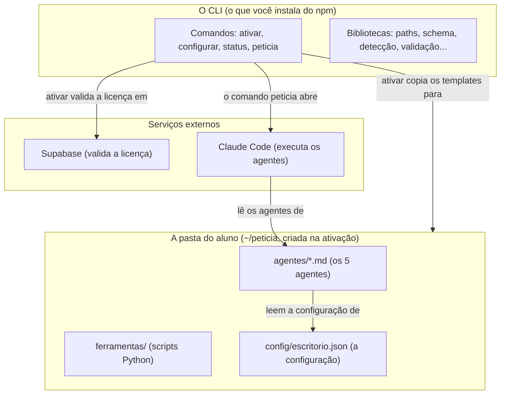
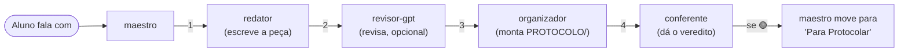
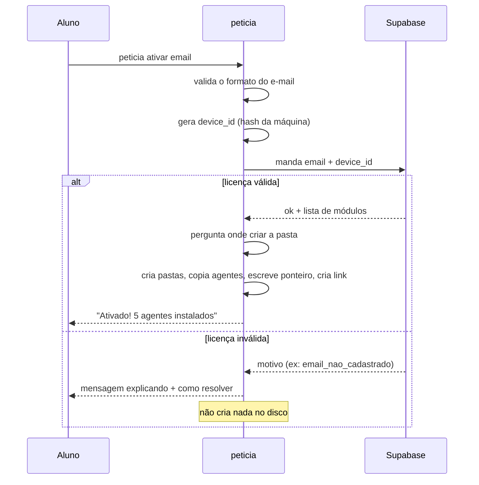
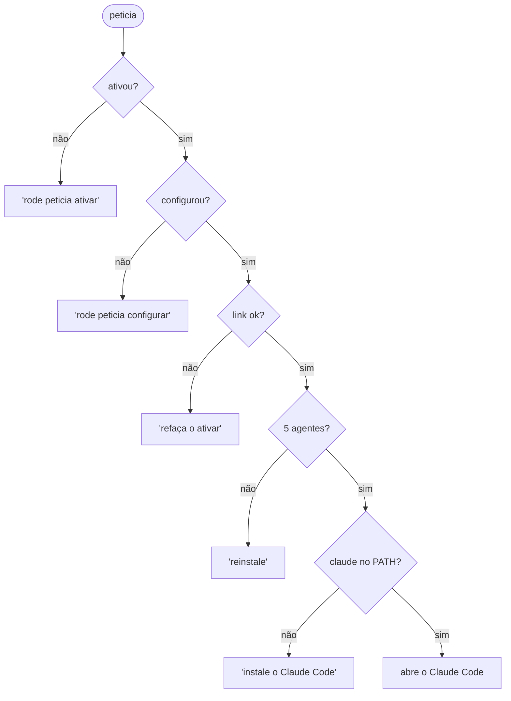

# Guia do desenvolvedor — peticia

Este guia explica o projeto inteiro do zero, para alguém que nunca o viu antes.
Se você é um dev iniciante, comece por aqui. Cada conceito é explicado quando
aparece pela primeira vez.

> Outros documentos: [`../CLAUDE.md`](../CLAUDE.md) é o resumo denso para quem já
> conhece; [`DECISOES.md`](DECISOES.md) explica *por que* cada escolha foi feita;
> [`HISTORICO.md`](HISTORICO.md) conta a construção passo a passo.

---

## 1. O que é o peticia (em uma página)

Advogados de Direito do Consumidor escrevem muitas **petições iniciais** — o
documento que abre um processo. É trabalho repetitivo: pegar os documentos do
cliente, escolher um modelo, preencher, revisar, organizar os anexos, conferir.

O **peticia** automatiza isso usando o **Claude Code** (a ferramenta de IA da
Anthropic que roda no terminal). O advogado instala o peticia uma vez, e depois
conversa em português com um agente de IA que faz o trabalho pesado.

O peticia em si é um **CLI** — um programa de linha de comando. Ele **não** é a
IA; ele **instala e conecta** os agentes de IA e cuida da parte "chata"
(licença, configuração do escritório, onde ficam as pastas). Quem redige é o
Claude Code, usando os agentes que o peticia instalou.

**Vocabulário mínimo** (se você já sabe, pule):

| Termo | O que é |
| --- | --- |
| **CLI** | *Command-Line Interface*. Um programa que você roda digitando comandos no terminal, ex.: `peticia ativar`. |
| **npm** | O gerenciador de pacotes do Node.js. `npm install -g peticia` baixa e instala o programa no computador. |
| **Node.js** | O ambiente que roda JavaScript fora do navegador. O peticia é escrito em JavaScript e roda no Node. |
| **ESM** | *ECMAScript Modules*. A forma moderna de organizar arquivos JS com `import`/`export` (em vez do antigo `require`). |
| **Claude Code** | A ferramenta de IA da Anthropic que roda no terminal e executa tarefas lendo/escrevendo arquivos. |
| **Agente** | Um arquivo de instruções (`.md`) que diz ao Claude Code como se comportar numa tarefa específica (redigir, revisar, etc.). |

---

## 2. Rodando o projeto na sua máquina

Você precisa do **Node.js 20 ou superior**. Confira com `node --version`.

```bash
git clone https://github.com/henriquechavesjus/peticia.git
cd peticia
npm install       # baixa as dependências (commander, inquirer, chalk, ...)
npm test          # roda os 108 testes — todos devem passar
npm link          # cria o comando `peticia` global apontando para este código
peticia --help    # confere que funcionou
```

`npm link` é útil no desenvolvimento: você edita o código e o comando `peticia`
já reflete a mudança, sem reinstalar. Para desfazer: `npm unlink -g peticia`.

**Modo sandbox** — durante o desenvolvimento você não quer que o programa mexa
na sua pasta real. Quase todo comando aceita `--sandbox`, que faz o peticia
trabalhar dentro de `~/.peticia-sandbox/` em vez da sua home. Assim você testa à
vontade sem sujar nada.

---

## 3. Visão geral da arquitetura

O peticia tem três "camadas":



Em palavras:

1. Você instala o **CLI** do npm. Ele tem os comandos de setup.
2. `peticia ativar` valida sua licença no **Supabase** e **copia os agentes**
   (que moram em `templates/` dentro do pacote) para a sua pasta `~/peticia/`.
3. `peticia configurar` pergunta os dados do seu escritório e salva num arquivo
   `escritorio.json`.
4. `peticia` (sem argumentos) abre o **Claude Code**, que carrega os agentes e
   conversa com você.

---

## 4. Os quatro conceitos centrais

Se você entender estes quatro, entende o projeto.

### 4.1. O ponteiro — "onde está a pasta do aluno?"

O aluno pode instalar a pasta principal em `~/peticia`, ou em
`~/Documentos/peticia`, ou onde quiser. Então, quando amanhã ele rodar
`peticia status`, como o programa sabe onde a pasta está?

Resposta: um **ponteiro** — um arquivinho num lugar **fixo e previsível**:

```
~/.peticia/instalacao.json
```

Esse arquivo guarda o caminho escolhido:

```json
{
  "pasta_peticia": "/Users/henrique/Desktop/peticia",
  "agentes_instalados": ["redator", "revisor-gpt", "organizador", "conferente", "maestro"],
  "email": "henrique@...",
  "versao_cli": "0.1.0"
}
```

Por que na home, e não dentro de `~/peticia`? Porque haveria uma **circularidade**:
para achar a pasta você precisaria já saber onde ela está. O ponteiro quebra
isso ficando sempre no mesmo lugar. Toda a lógica está em
[`src/lib/paths.js`](../src/lib/paths.js), na função `getPeticiaHome()`.

> Detalhe importante: **tanto `ativar` quanto `configurar` escrevem o ponteiro.**
> O que diferencia "o aluno já ativou" de "o aluno só configurou" é o campo
> `agentes_instalados` — só o `ativar` o preenche. Essa distinção reaparece em
> vários lugares (o comando `peticia`, o pulo da Etapa 0 no `configurar`).

### 4.2. Templates → a pasta do aluno

Os cinco agentes e os scripts Python moram dentro do pacote, na pasta
`templates/`. Quando o aluno roda `peticia ativar`, a função `instalarTemplates`
([`src/lib/instalacao.js`](../src/lib/instalacao.js)) **copia** esses arquivos
para a pasta dele:

```
templates/agentes/redator.md   →   ~/peticia/agentes/redator.md
templates/lib/peticao_lib.py   →   ~/peticia/lib/peticao_lib.py
...
```

Regra de ouro: **nunca sobrescreve o que o aluno editou.** Depois de instalados,
os agentes são dele — ele pode mudar o texto. A cópia só cria o que ainda não
existe.

### 4.3. O link simbólico — como o Claude Code enxerga os agentes

O Claude Code procura agentes só numa pasta: `~/.claude/agents/`. Mas os agentes
do peticia estão em `~/peticia/agentes/`. Como conectar os dois?

Com um **link simbólico** (um atalho, no nível do sistema de arquivos):

```
~/.claude/agents/peticia   →   ~/peticia/agentes/
```

Assim o Claude Code "vê" os agentes sem que a gente precise copiá-los para
dentro de `~/.claude`. No Windows usamos *junction* em vez de symlink (symlink de
pasta lá exige permissão de administrador; junction não).

### 4.4. Os agentes e o pipeline

Um **agente** é um arquivo Markdown com instruções para o Claude Code. O peticia
tem cinco, que trabalham em linha de montagem:



- **maestro** — o cérebro. Entende o pedido do aluno em português ("faça a
  próxima inicial") e chama os outros na ordem. Não faz o trabalho; delega.
- **redator** — lê a pasta do caso, analisa documentos e mídias, escreve a
  petição. **Aborta cedo** se os documentos estão inconsistentes (ex.: CPF
  diferente entre RG e procuração) — assim não gasta tempo redigindo algo que
  seria rejeitado.
- **revisor-gpt** — opcional (só se o aluno configurou uma chave OpenAI). Pede
  uma segunda opinião a um modelo GPT e aplica só correções seguras, numa cópia.
- **organizador** — monta a pasta `PROTOCOLO/` com tudo pronto para enviar
  (petição em Word, documentos em PDF).
- **conferente** — a última checagem. Lê a petição pronta, confere se os dados
  batem, e dá um veredito: 🟢 pronto, 🟡 atenção, 🔴 não pode protocolar.

Cada agente tem duas zonas marcadas: `=== NÚCLEO ===` (a lógica; mexa com
cuidado) e `=== ESTILO ===` (preferências que o aluno pode ajustar).

---

## 5. Mapa dos arquivos

### O CLI (`src/`)

| Arquivo | Linhas | O que faz |
| --- | --- | --- |
| `cli.js` | 93 | Monta os comandos (usando a biblioteca `commander`) e trata erros. Ponto de entrada. |
| `constants.js` | — | Nomes fixos (nome do produto, subpastas). |
| **commands/** | | |
| `peticia.js` | 48 | O comando `peticia` (uso diário): valida o setup e abre o Claude Code. |
| `ativar.js` | 211 | Valida a licença online e instala tudo na máquina do aluno. |
| `configurar.js` | 495 | O wizard interativo do escritório (o maior arquivo). |
| `status.js` | 20 | Mostra o painel de estado. |
| `index.js` | 79 | Registra os comandos e os stubs (comandos ainda não feitos). |
| **lib/** | | |
| `paths.js` | 168 | O coração: resolve todos os caminhos, lê o ponteiro, trata o sandbox. |
| `instalacao.js` | 180 | Cria a estrutura de pastas, copia os templates, escreve o ponteiro, cria o link. |
| `escritorio-schema.js` | 181 | A "forma" do `escritorio.json`: monta, valida, canoniza OAB. |
| `detectar-pastas.js` | 198 | Adivinha as pastas do escritório (fila, modelos, timbrado...) pelo nome. |
| `coletor-status.js` | 198 | Junta todos os dados que o `status` mostra (sem imprimir nada). |
| `formatador-status.js` | 198 | Transforma esses dados no painel colorido (só apresentação). |
| `ambiente.js` | 124 | Valida se a instalação está completa (usado pelo comando `peticia`). |
| `supabase.js` | 65 | Fala com o backend (a Edge Function que valida a licença). |
| `device.js` | 29 | Gera um "id do dispositivo" anônimo (hash da máquina). |
| `validar-caminho.js` | 53 | Valida um caminho digitado (é pasta? é arquivo .docx?). |
| `escolher-local.js` | 58 | A pergunta "onde criar a pasta?", compartilhada por ativar e configurar. |
| `ui.js` | 51 | Funções de saída no terminal (cores, ✓, avisos). |
| `versao.js` | 7 | Lê a versão do `package.json`. |

### Os templates (`templates/`) — copiados para o aluno

| Arquivo | Linhas | O que é |
| --- | --- | --- |
| `agentes/maestro.md` | 146 | O orquestrador. |
| `agentes/redator.md` | 222 | O que escreve a petição (o maior). |
| `agentes/revisor-gpt.md` | 116 | A revisão opcional via GPT. |
| `agentes/organizador.md` | 125 | A montagem da pasta de protocolo. |
| `agentes/conferente.md` | 107 | A conferência final. |
| `lib/peticao_lib.py` | 153 | Motor Python que gera o `.docx` com a formatação certa. |
| `ferramentas/correcao-inicial-gpt/corrigir_inicial.py` | 369 | Chama a API da OpenAI para a revisão. |
| `ferramentas/organizador/organizar_pasta.py` | 200 | Converte imagens em PDF e monta o `PROTOCOLO/`. |

### Outros

- `bin/peticia.js` — o "atalho" que o npm usa para rodar o CLI.
- `supabase/functions/ativar/index.ts` — a **Edge Function**: código que roda no
  servidor Supabase e valida a licença. **Não** vai para o pacote npm (fica só
  no repositório).
- `supabase/migrations/*.sql` — o que precisa existir no banco para a função
  trabalhar (hoje: a tabela e a função do limite de chamadas). Também fora do
  pacote.

> **Por que o servidor decide, e não o CLI?** A chave que o CLI carrega é
> pública — está dentro do pacote que qualquer pessoa baixa. Então ela não pode
> dar poder nenhum: quem decide quem tem acesso é a Edge Function, que roda no
> servidor com uma chave secreta que ninguém vê. Se a decisão fosse no CLI,
> bastaria editar o arquivo para se dar acesso.
>
> Uma consequência menos óbvia: como qualquer pessoa pode chamar a função, ela
> não pode nem *responder demais*. Se dissesse "esse e-mail não existe" para uns
> e "esse está vencido" para outros, daria para descobrir quem é aluno testando
> e-mails. Por isso toda recusa devolve exatamente a mesma resposta, sempre no
> mesmo tempo, e um mesmo computador só pode tentar 10 vezes por hora. Detalhes
> em `CLAUDE.md`, seção "O backend".
- `test/` — 10 arquivos de teste (ver seção 8).

---

## 6. Os fluxos, passo a passo

### 6.1. `peticia ativar seu@email.com`



O ponto-chave: **nada é criado no disco se o servidor recusar**. E o setup local
só acontece depois do "ok".

### 6.2. `peticia configurar`

Um wizard (assistente com perguntas) em etapas:

- **Etapa 0 — Local da pasta.** *Pulada* se o aluno já ativou (usa a pasta que o
  ativar escolheu).
- **Etapa 1 — Advogado.** Nome, OAB principal, OABs de outros estados.
- **Etapa 2 — Escritório.** Nome e a pasta raiz (o aluno pode arrastar a pasta
  do Finder para o terminal — o programa limpa as aspas e espaços que o Mac cola).
- **Etapa 3 — Detecção de pastas.** O programa varre a raiz e adivinha onde
  estão a fila, os modelos, o timbrado, etc. O aluno confirma.
- **Etapa 4 — Formatação.** Fonte, tamanhos, espaçamento (com padrões prontos).
- **Etapa 5 — OpenAI (opcional).** A chave para a revisão automática.

No fim, grava o `config/escritorio.json`.

### 6.3. `peticia` (uso diário)



É uma sequência de checagens que **falha rápido**: para no primeiro problema e
diz exatamente o que fazer. Só abre o Claude Code se tudo estiver certo. A lógica
das checagens está em [`src/lib/ambiente.js`](../src/lib/ambiente.js).

---

## 7. O `escritorio.json`, campo a campo

É o arquivo que os agentes leem para saber tudo sobre o escritório do aluno.

```jsonc
{
  "schema_versao": 1,              // versão do formato (para migrar no futuro)
  "advogado": {
    "nome": "Henrique Chaves Bernardo",
    "oab_principal": { "uf": "BA", "numero": "37.189" },
    "oabs_suplementares": {        // OAB por estado do cliente
      "SP": "501.909"              // cliente de SP → assina com a OAB/SP
    }
  },
  "escritorios": [{                // pode ter mais de um escritório
    "nome": "HC Advogados",
    "raiz": "/Users/.../Escritorio",
    "assinatura_dupla": false,     // true = assina com um sócio também
    "socio": null,                 // ou { nome, oab: {uf, numero} }
    "estrutura": {                 // as pastas de trabalho
      "fila_entrada": "01 - Fazer",           // casos esperando redação
      "para_protocolar": "02 - Para Protocolar", // prontas, esperando envio (opcional)
      "modelos": "Modelos",                   // templates de petição
      "timbrado": "Timbrado.docx",            // o papel timbrado (arquivo)
      "protocolados": null                    // já enviadas (opcional)
    }
  }],
  "formatacao": {                  // como o .docx deve ficar
    "fonte_corpo": "Calibri Light",
    "tamanho_corpo": 12,
    "tamanho_citacao": 10,
    "alinhamento": "justificado"
    // ...
  },
  "openai": { "configurada": false } // se o aluno pôs a chave (o valor da chave fica no .env)
}
```

Duas coisas que economizam bugs:

- O **número de OAB é canonizado**: o aluno pode digitar `37189`, `37-189` ou
  `37.189` — todos viram `37.189`. É essa string que sai impressa no rodapé da
  petição, então precisa ser sempre igual.
- Campos opcionais (`para_protocolar`, `protocolados`, `socio`) podem ser `null`.

---

## 8. Como os testes funcionam

Rode com `npm test`. São **108 testes** em 10 arquivos, usando o *test runner*
nativo do Node (`node --test`) — sem nenhuma biblioteca de teste extra.

A ideia central: **testar a lógica sem depender do mundo real.**

- Funções que mexem em arquivos (paths, instalação, detecção) são testadas com
  pastas temporárias descartáveis (`os.tmpdir()`), passando uma "base" falsa —
  nunca tocam a sua home de verdade.
- O que precisa de internet (`ativar`) é testado com um **servidor HTTP local
  falso** que imita o Supabase. Sua conta de produção nunca é tocada.
- O que precisa de um programa externo (`claude`, `python`) é testado mexendo no
  `PATH` ou por demonstração manual.
- **Guarda de segurança**: um teste *falha de propósito* se algum arquivo `.env`
  de verdade (com senha) for parar dentro de `templates/`. Isso impede vazar
  segredo para o npm.

Uma limitação honesta: os agentes são arquivos de texto (instruções para a IA),
não código. Os testes garantem que as instruções certas continuam no arquivo,
mas **não** conseguem provar que a IA se comporta como esperado. Verificar isso
exige rodar os agentes de verdade — o que ainda não foi feito de ponta a ponta.

---

## 9. Glossário rápido

| Termo | Significado no projeto |
| --- | --- |
| **Ponteiro** | O `~/.peticia/instalacao.json`, que diz onde está a pasta do aluno. |
| **Sandbox** | Modo de teste (`--sandbox`) que usa `~/.peticia-sandbox/` no lugar da home. |
| **Template** | Arquivo dentro de `templates/` que é copiado para o aluno na ativação. |
| **Agente** | Instruções `.md` para o Claude Code (maestro, redator, etc.). |
| **Pipeline** | A sequência redator → revisor → organizador → conferente. |
| **Edge Function** | Código no servidor Supabase que valida a licença. |
| **Link simbólico / junction** | O atalho que conecta `~/.claude/agents/peticia` aos agentes do aluno. |
| **Canonizar** | Padronizar um valor (ex.: número de OAB) para uma forma única. |
| **Timbrado** | O arquivo `.docx` com o cabeçalho/rodapé do escritório. |
| **PROTOCOLO/** | A pasta que o organizador monta, pronta para enviar ao tribunal. |

---

## 10. Para onde ir depois

- Quer o resumo denso e técnico? [`../CLAUDE.md`](../CLAUDE.md).
- Quer entender *por que* algo foi feito assim? [`DECISOES.md`](DECISOES.md).
- Quer ver a construção passo a passo? [`HISTORICO.md`](HISTORICO.md).
- Quer usar o produto? [`../README.md`](../README.md).
